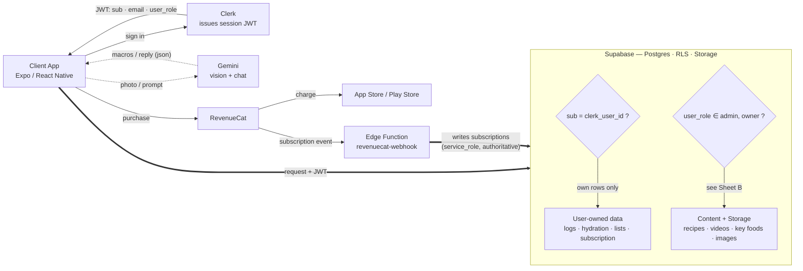

# NutriCycle — Architecture

Two diagrams: how a request actually moves through the system, and the exact
claim-based mechanism that decides whether an Admin write succeeds.

## Sheet A — Request flow

Every request the client makes to Supabase carries the JWT Clerk just issued.
Which of the two lanes inside Supabase it can use depends on the `user_role`
claim in that token, not on anything the client claims about itself. AI calls
skip Supabase entirely — the client talks to Gemini directly. Purchases
settle with the platform store, but the subscription row that actually
unlocks Premium is only ever written by the webhook, using the service role
— the client's own write is never the source of truth.



**Note:** the Gemini calls bypass Supabase entirely — the API key ships
inside the client bundle. Reads on `Content + Storage` are public; only
writes are role-gated.

## Sheet B — The claim that decides an admin write

The two lanes in Sheet A that require `user_role` only work because of this
fix. The original policy checked the JWT's `role` claim, which PostgREST
reserves for its own use — it's always the literal string `"authenticated"`,
regardless of who is signed in, because that claim is what PostgREST reads to
decide which Postgres role runs the query. Every admin save failed silently
until the policy moved to a second, custom claim.

```mermaid
flowchart TB
    subgraph Rejected["REJECTED — auth.jwt() ->> 'role'"]
        direction TB
        A1["Clerk JWT<br/>role: \"authenticated\" (reserved by PostgREST)"]
        A2{"RLS policy:<br/>role = 'admin' ?"}
        A3["✕ always false<br/>write rejected for every real admin"]
        A1 --> A2 --> A3
    end

    subgraph Fixed["FIXED — auth.jwt() ->> 'user_role'"]
        direction TB
        B1["Clerk JWT<br/>+ user_role: {{user.public_metadata.role}}"]
        B2{"RLS policy:<br/>user_role = 'admin' ?"}
        B3["✓ true for real admins<br/>write succeeds; everyone else still fails"]
        B1 --> B2 --> B3
    end
```

---
*Internal architecture reference — not user-facing documentation.*
